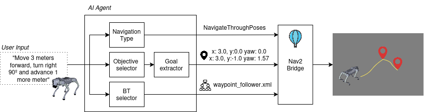

# nav2_agent

[](https://docs.ros.org/en/jazzy/)
[](LICENSE)
[](https://ai.pydantic.dev/)

**`nav2_agent`** is a modular and deterministic architecture for connecting locally deployed Large Language Models (LLMs) with the **Nav2** navigation stack in ROS 2.

Through structured output validation with `PydanticAI`, the agent acts as a **semantic parser and Behavior Tree author**. It interprets natural-language metric motion commands, selects `NavigateToPose` or `NavigateThroughPoses`, extracts explicit `TargetPose` data, generates a Nav2 Behavior Tree (BT) XML document, and lets the ROS node generate the Nav2 goal through a bridge layer backed by ROS 2 Action Clients.

---

## Motivation and Approach

Unlike end-to-end black-box robotics policies, **`nav2_agent`** follows a layered design:

1. **The AI extracts and authors:** It interprets natural-language metric motion commands, chooses the Nav2 action type, frames, poses, and generates Behavior Tree XML from an authoring reference.
2. **The node validates and sends:** The ROS node validates the structured plan, writes the generated BT XML to disk, builds the Nav2 action goal, and sends it through the bridge.
3. **Nav2 executes:** Nav2 remains responsible for local, deterministic robot control, path planning, recovery, and safety policies.
4. **Inference stays local:** The agent is designed for local OpenAI-compatible inference servers, especially **vLLM**, avoiding cloud API latency and external runtime dependencies.

The goal is not to let an LLM drive the robot directly. The goal is to let the LLM choose and parameterize explicit, validated robotic actions.

---



---

## System Architecture

```text
 ┌────────────────────────────────────────────────────────┐
 │            Local vLLM Server (OpenAI API)              │
 └──────────────────────────┬─────────────────────────────┘
                            │ Structured NavigationPlan
                            ▼
 ┌─────────────────────────────────────────────────────────┐
 │             nav2_agent Node (PydanticAI)                │
 │                                                         │
 │  • LLM output: action, pose(s), frame(s), config BT XML │
 │  • Node validation: XML shape and plan consistency      │
 │  • Goal builder: NavigateToPose / NavigateThroughPoses  │
 └──────────────────────────┬──────────────────────────────┘
                            │ ROS 2 Action Clients
                            ▼
 ┌────────────────────────────────────────────────────────┐
 │                 NAV2 INTEGRATION LAYER                 │
 │      ActionClient goals for Nav2 Navigate actions      │
 │     (/navigate_to_pose | /navigate_through_poses)      │
 └────────────────────────────────────────────────────────┘
```

---

## Repository Structure

```text
nav2_agent/
├── config/
│   ├── agent_params.yaml       # vLLM model, API base, prompt, and runtime parameters
│   └── bt_catalog.yaml         # Local Behavior Tree reference/examples for the prompt
├── docker/
│   ├── Dockerfile              # ROS 2 Jazzy development image with PydanticAI support
│   ├── docker-compose.yml      # Host-networked development container setup
│   ├── build.sh                # Convenience Docker build helper
│   └── entrypoint.sh           # ROS environment entrypoint
├── launch/
│   └── nav2_agent.launch.py    # Main launch file
├── nav2_agent/
│   ├── agent_node.py           # Main ROS 2 node using rclpy and MultiThreadedExecutor
│   ├── pydantic_agent.py       # PydanticAI agent and system prompt for NavigationPlan extraction
│   ├── models.py               # Pydantic schemas: TargetPose, BehaviorTreeSpec, NavigationPlan, AgentResponse
│   └── nav2_bridge.py          # ROS 2 ActionClient bridge to Nav2 navigation actions
├── package.xml
├── setup.cfg
└── setup.py
```

---

## Installation and Requirements

### Requirements

- **ROS 2:** Jazzy Jalisco.
- **Python:** $\ge 3.10$
- **LLM backend:** A local [vLLM](https://github.com/vllm-project/vllm) server exposing the OpenAI-compatible API.
- **Python packages:** `pydantic`, `pydantic-ai`, `openai`, and `PyYAML`.

### Clone and Build in a ROS 2 Workspace

```bash
cd ~/ros2_ws/src
git clone https://github.com/Eurecat/nav2_agent.git

# Install Python dependencies in your active environment.
python3 -m pip install pydantic pydantic-ai openai PyYAML

cd ~/ros2_ws
colcon build --packages-select nav2_agent
source install/setup.bash
```

### Docker Development Environment

The repository includes a ROS 2 Jazzy Docker setup with the required Python agent dependencies installed in an isolated virtual environment.

```bash
cd docker
./build.sh
docker compose run --rm nav2_agent
```

Inside the container:

```bash
cb
ros2 launch nav2_agent nav2_agent.launch.py
```

To rebuild without cache:

```bash
./build.sh --no-cache
```

---

## Configuration

Edit [config/agent_params.yaml](config/agent_params.yaml) to point the agent to your local vLLM server:

```yaml
nav2_agent_node:
  ros__parameters:
    vllm_api_base: "http://localhost:8000/v1"
    vllm_api_key: "EMPTY"
    vllm_model_name: "gemma-4-e4b"
    bt_catalog_path: ""
    generated_bt_dir: "/tmp/nav2_agent/behavior_trees"
    default_trigger_command: "Move 1 meter forward using the default behavior tree."
    navigate_to_pose_action: "/navigate_to_pose"
    navigate_through_poses_action: "/navigate_through_poses"
    action_server_timeout_sec: 5.0
    agent_run_timeout_sec: 90.0
    dry_run_nav2: false
    system_prompt: |
      You are a robotic navigation command orchestrator for a ROS 2 robot using Nav2.
      Interpret metric motion commands, choose a Nav2 action, extract pose data,
      and generate a simple Nav2 Behavior Tree XML document.
```

Frame convention:

- Explicit global coordinates use `frame_id: map` unless the command names another frame.
- Relative robot motion such as forward, backward, left, right, lateral movement, or rotation uses `frame_id: base_link` unless the command names another frame.
- ROS planar axes are used: `x` forward, `y` left, right as negative `y`, backward as negative `x`, and `theta` as yaw in radians.
- Right turns use negative `theta`; left turns use positive `theta`.
- Commands that combine translation and rotation are represented as `NavigateThroughPoses`: first the translation pose, then the rotation pose.
- Degrees in user commands are converted to radians before creating the `TargetPose`.

For local testing without Nav2 action servers, set `dry_run_nav2: true` or launch with `dry_run_nav2:=true`. The node will log the action goal it would send.

For verbose agent-level testing, launch with `log_level:=debug`. The node logs pydantic-ai request/response counts, retry parts when present, model output calls when present, and a raw vLLM `/chat/completions` diagnostic on failed agent runs.

Edit [config/bt_catalog.yaml](config/bt_catalog.yaml) to provide local Behavior Tree examples and usage notes to the prompt. The agent is no longer limited to selecting an existing XML filename; it generates a complete XML document, the node validates the basic XML shape, writes it under `generated_bt_dir`, and passes that generated file path to Nav2 through the action goal `behavior_tree` field.

---

## Usage

### 1. Start a Local vLLM Server

```bash
vllm serve google/gemma-4-E4B-it --served-model-name gemma-4-e4b --host 0.0.0.0 --port 8080 --api-key EMPTY --generation-config vllm --enable-auto-tool-choice --tool-call-parser gemma4
```

If you launch vLLM with `--served-model-name`, set `vllm_model_name` to that served alias rather than the Hugging Face model id.

You can also launch the vLLM Gemma4 server by executing:

```bash
./scripts/gemma4_server.sh
```

Check that the OpenAI-compatible endpoint is reachable:

```bash
curl -H 'Authorization: Bearer EMPTY' http://192.168.55.1:8080/v1/models
```

### 2. Launch the `nav2_agent` Node

```bash
ros2 launch nav2_agent nav2_agent.launch.py
```

For dry-run testing without Nav2 action servers:

```bash
ros2 launch nav2_agent nav2_agent.launch.py dry_run_nav2:=true log_level:=debug
```

### 3. Send a Natural-Language Instruction

Publish a user command through `/user_command`:

```bash
ros2 topic pub /user_command std_msgs/msg/String "data: 'Move 2 meters forward'" --once
```

Example metric commands:

```bash
ros2 topic pub /user_command std_msgs/msg/String "data: 'Move 2 meters forward'" --once
ros2 topic pub /user_command std_msgs/msg/String "data: 'Move 0.5 meters to the right'" --once
ros2 topic pub /user_command std_msgs/msg/String "data: 'Rotate 90 degrees to the left'" --once
ros2 topic pub /user_command std_msgs/msg/String "data: 'Go to x 1.5 y 2.0 in map'" --once
```

Monitor agent status:

```bash
ros2 topic echo /nav2_agent/status --field data --full-length
```

You can also trigger execution through the service. The `std_srvs/srv/Trigger` service does not carry arbitrary command text, so the node executes the last command received on `/user_command`, or `default_trigger_command` if no command has been received yet.

```bash
ros2 service call /nav2_agent/trigger_command std_srvs/srv/Trigger {}
```

---

## Current Implementation Status

This repository currently targets ROS 2 Jazzy and provides the agent architecture plus a ROS 2 ActionClient-based Nav2 navigation boundary:

- The agent uses `pydantic-ai` with an OpenAI-compatible vLLM endpoint.
- The pydantic-ai agent exposes pure planning tools for selecting the Nav2 action type, constructing `TargetPose` values, and creating a Behavior Tree XML document; these tools do not send Nav2 goals.
- The model returns a structured `NavigationPlan`: action type, target pose or poses, frame ids, yaw, and generated simple Behavior Tree XML.
- The ROS node validates the plan, writes the generated BT XML, and builds the corresponding Nav2 action goal.
- `Nav2Bridge` sends real `NavigateToPose` and `NavigateThroughPoses` goals through ROS 2 Action Clients.
- `Nav2Bridge` converts validated `TargetPose` objects into `geometry_msgs/msg/PoseStamped` goals.
- Generated Behavior Tree XML files are written to disk and their paths are passed to Nav2 through the `behavior_tree` goal field.

---

## Presented at ROSCon Spain 2026

This package was presented as a technical talk at **ROSCon Spain 2026**:

- **Title:** *Integrating Nav2 with LLM Agents: From Natural Language to NavigateToPose*
- **Author:** Pau Reverté
- **Organization:** Eurecat Technology Centre, Robotics and Automation Unit

---

## License

This project is distributed under the **Apache 2.0** license. See the `LICENSE` file for details.

---

## Contact and Contributions

Developed and maintained by the **Robotics and Automation Unit at Eurecat**.

- **Author:** Pau Reverté
- **Email:** [pau.reverte@eurecat.org](mailto:pau.reverte@eurecat.org)
- **Organization:** [Eurecat Technology Centre](https://eurecat.org)

Contributions, issues, and pull requests are welcome.
