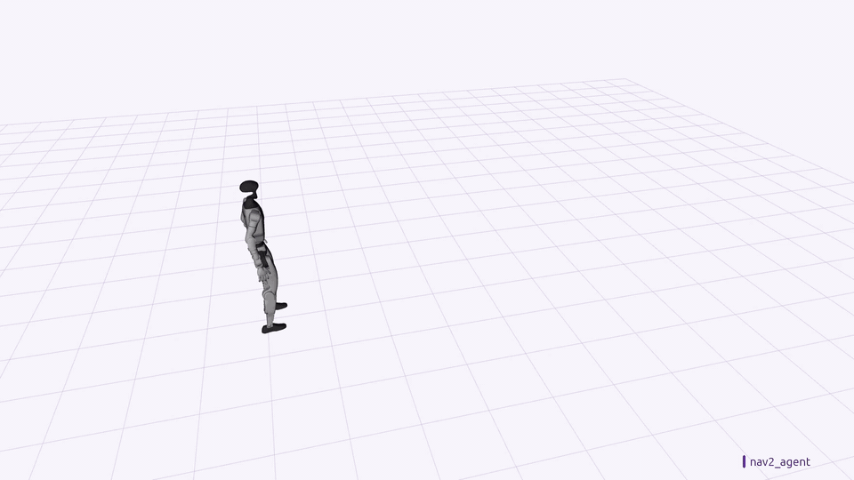
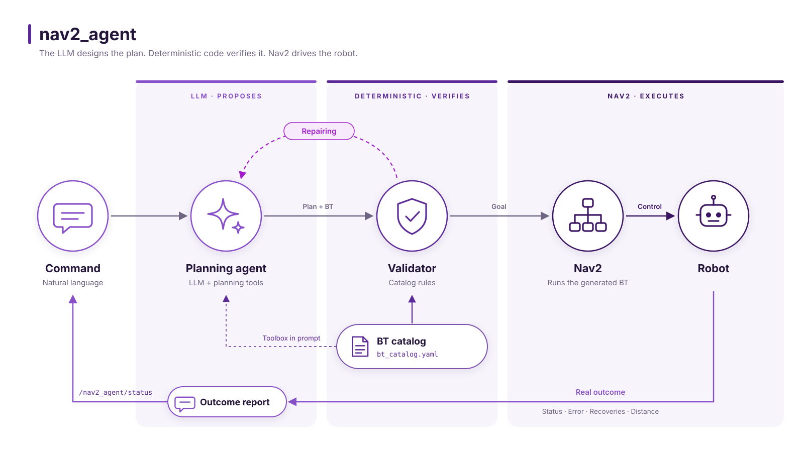
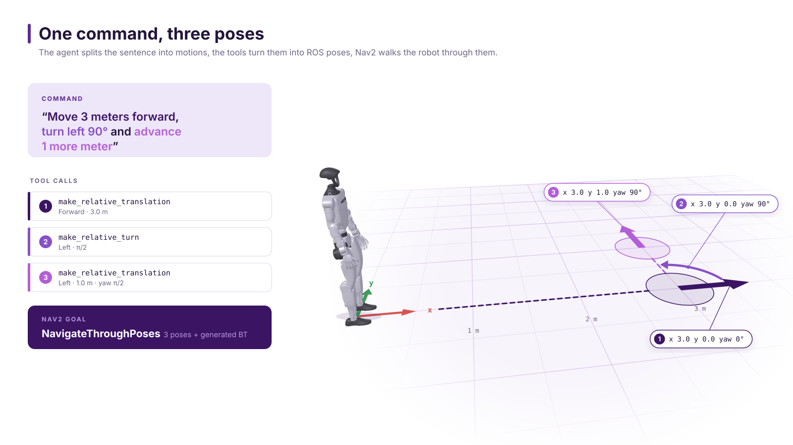
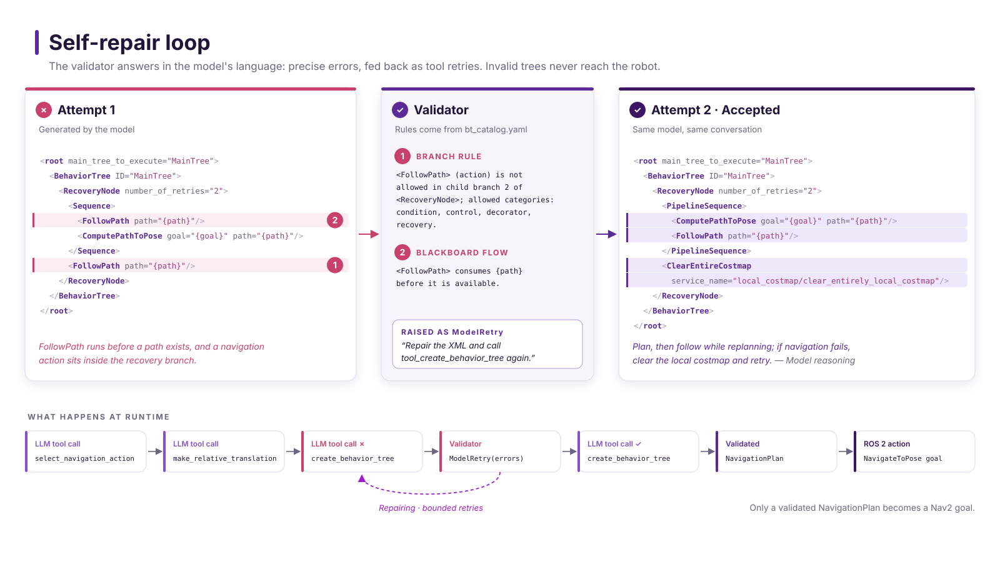

# nav2_agent

**Tell your robot where to go, in plain words.**
`nav2_agent` turns a sentence like *"Move 3 meters forward, turn left 90° and advance 1 more meter"* into a safe, validated navigation plan that Nav2 executes on a real robot.


[](docs/media/nav2_agent_demo.mp4)

<sub>Unitree G1 in simulation.</sub>

## Features

- **Natural-language commands** for relative motions, rotations, map coordinates and multi-step routes.
- **Nav2 execution.** Plans are sent as standard `NavigateToPose` and `NavigateThroughPoses` goals; the LLM does not command motion directly.
- **Generated Behavior Trees.** Each command gets its own Nav2 Behavior Tree, composed from a configurable catalog of nodes, including recovery branches when needed.
- **Validation before execution.** Every plan and tree is checked against the catalog rules; invalid trees are returned to the model for correction.
- **Outcome reports.** After execution, the agent summarizes the Nav2 result: goal reached, recoveries used, or cause of failure.
- **Local deployment.** Works with any OpenAI-compatible model server, including on-robot computers such as NVIDIA Jetson.

## How it works



1. **You give a command** in natural language.
2. **The planning agent** breaks it into motions. The model decides *what* to do; small tools compute the exact ROS poses.
3. **The validator** checks the plan and the Behavior Tree against a catalog of allowed building blocks. Anything invalid goes back to the model for repair.
4. **Nav2 runs the tree** on the robot. Recoveries happen inside Nav2 in real time, without waiting for the LLM.
5. **The agent reports** the real outcome: whether the goal was reached, how many recoveries were needed, and why it failed if it did.

### From one sentence to three poses



### It fixes its own mistakes



## What you can say

| Command | What the robot does |
| --- | --- |
| *"Move 2 meters forward"* | Moves 2 m straight ahead |
| *"Move 0.5 meters to the right"* | Moves 0.5 m sideways to its right |
| *"Rotate 90 degrees to the left"* | Turns in place to face left |
| *"Go to x 1.5 y 2.0 in map"* | Navigates to that point on the map |
| *"Move 3 meters forward, turn left 90° and advance 1 more meter"* | Chains the three motions into a single route |

## Quick start

You need Docker and an LLM server that speaks the OpenAI API with tool calling, such as [vLLM](https://docs.vllm.ai) or [llama.cpp](https://github.com/ggml-org/llama.cpp). See [Model server](docs/technical.md#model-server) for ready-to-use commands.

**1. Build and enter the container**

```bash
cd docker && ./build.sh
docker compose run --rm nav2_agent
cb   # builds the workspace inside the container
```

**2. Point the agent at your model** by setting `vllm_api_base` and `vllm_model_name` in [config/agent_params.yaml](config/agent_params.yaml).

**3. Launch it and talk to it**

```bash
# Add dry_run_nav2:=true to try it without a robot or Nav2
ros2 launch nav2_agent nav2_agent.launch.py

# In another terminal
ros2 topic pub --once /user_command std_msgs/msg/String "data: 'Move 2 meters forward'"
ros2 topic echo /nav2_agent/status --field data
```

Every generated Behavior Tree is saved as XML and as a Mermaid diagram under `/tmp/nav2_agent/behavior_trees`, so you can inspect exactly what the robot ran.

## Learn more

The [technical guide](docs/technical.md) covers configuration, the Behavior Tree catalog and its rules, ROS interfaces, the status messages and tests.

## About

Developed at [Eurecat](https://eurecat.org), Centre Tecnològic de Catalunya.
Licensed under [Apache 2.0](LICENSE).
